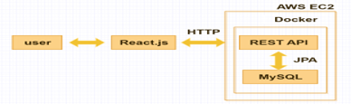

# Olive-bakery REST API

## Structure

구현 사항

1. RESTful API 구현
- Spring boot framework 사용
- JPA + QueryDSL을 사용한 ORM, 쿼리 메소드화
- 빵을 등록하고 수정, 삭제하는 기능 구현
- 이미지 업&다운로드 기능 구현

2. Deployment
- AWS EC2 인스턴스를 생성하여 서버 운영
- Maven build -> Docker build -> run
